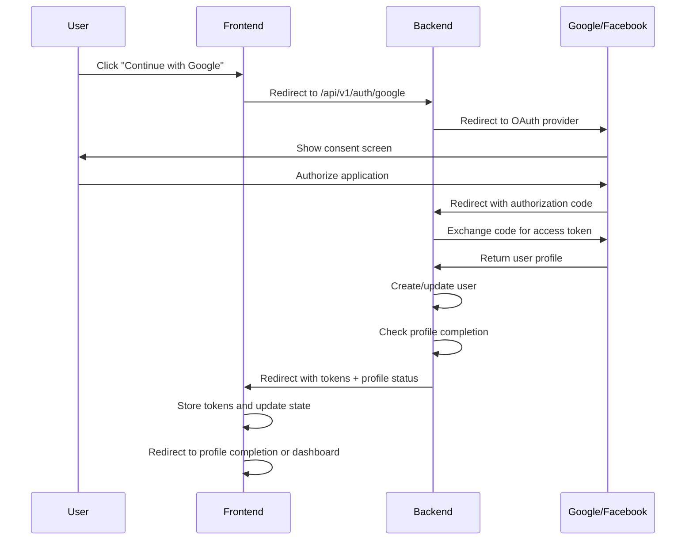

# Frontend Integration Guide

This guide explains how to integrate the social authentication components into your React frontend application.

## Table of Contents

1. [Installation](#installation)
2. [Environment Setup](#environment-setup)
3. [Component Integration](#component-integration)
4. [Authentication Flow](#authentication-flow)
5. [State Management](#state-management)
6. [Routing Setup](#routing-setup)
7. [Styling](#styling)
8. [Testing](#testing)
9. [Production Deployment](#production-deployment)

## Installation

### 1. Install Dependencies

```bash
npm install react-router-dom
```

### 2. Copy Components

Copy the following files from `frontend-examples/` to your React project:

```
src/
├── components/
│   ├── SocialLoginButton.jsx
│   ├── SocialLoginButton.css
│   ├── SocialLoginForm.jsx
│   ├── SocialLoginForm.css
│   ├── AuthCallback.jsx
│   └── AuthCallback.css
├── hooks/
│   └── useAuth.js
├── pages/
│   ├── LoginPage.jsx
│   └── Dashboard.jsx
└── App.js
```

## Environment Setup

### 1. Create Environment File

Create a `.env` file in your React project root:

```env
# Development
REACT_APP_API_URL=http://localhost:5000

# Production (update when deploying)
# REACT_APP_API_URL=https://yourdomain.com
```

### 2. Environment Variables

| Variable            | Description          | Example                 |
| ------------------- | -------------------- | ----------------------- |
| `REACT_APP_API_URL` | Backend API base URL | `http://localhost:5000` |

## Component Integration

### 1. Basic Integration

```jsx
import React from "react";
import { AuthProvider } from "./hooks/useAuth";
import SocialLoginForm from "./components/SocialLoginForm";

function App() {
  const handleLoginSuccess = (user) => {
    console.log("User logged in:", user);
    // Handle successful login
  };

  const handleLoginError = (error) => {
    console.error("Login failed:", error);
    // Handle login error
  };

  return (
    <AuthProvider>
      <div className="App">
        <SocialLoginForm
          onSuccess={handleLoginSuccess}
          onError={handleLoginError}
        />
      </div>
    </AuthProvider>
  );
}

export default App;
```

### 2. Custom Login Button

```jsx
import React from "react";
import SocialLoginButton from "./components/SocialLoginButton";

function CustomLoginPage() {
  const handleGoogleLogin = () => {
    window.location.href = `${process.env.REACT_APP_API_URL}/api/v1/auth/google`;
  };

  const handleFacebookLogin = () => {
    window.location.href = `${process.env.REACT_APP_API_URL}/api/v1/auth/facebook`;
  };

  return (
    <div className="login-page">
      <h1>Welcome to Educate Global Hub</h1>

      <SocialLoginButton provider="google" onClick={handleGoogleLogin}>
        Sign in with Google
      </SocialLoginButton>

      <SocialLoginButton provider="facebook" onClick={handleFacebookLogin}>
        Sign in with Facebook
      </SocialLoginButton>
    </div>
  );
}

export default CustomLoginPage;
```

## Authentication Flow

### 1. OAuth Redirect Flow



### 2. API-Based Flow (for Mobile Apps)

```jsx
import { useAuth } from "./hooks/useAuth";

function MobileLogin() {
  const { login } = useAuth();

  const handleSocialLogin = async (provider, accessToken) => {
    try {
      const response = await fetch(
        `${process.env.REACT_APP_API_URL}/api/v1/auth/social-login`,
        {
          method: "POST",
          headers: {
            "Content-Type": "application/json",
          },
          body: JSON.stringify({
            provider,
            accessToken,
          }),
        }
      );

      if (response.ok) {
        const data = await response.json();
        login(data.data.user, data.data.accessToken, data.data.refreshToken);
      } else {
        throw new Error("Login failed");
      }
    } catch (error) {
      console.error("Social login error:", error);
    }
  };

  return <div>{/* Your mobile-specific login UI */}</div>;
}
```

## State Management

### 1. Using the Auth Context

```jsx
import React from "react";
import { useAuth } from "./hooks/useAuth";

function UserProfile() {
  const { user, isAuthenticated, logout } = useAuth();

  if (!isAuthenticated) {
    return <div>Please log in</div>;
  }

  return (
    <div>
      <h2>
        Welcome, {user.firstName} {user.lastName}
      </h2>
      <p>Email: {user.email}</p>
      <p>Role: {user.role}</p>
      <button onClick={logout}>Logout</button>
    </div>
  );
}

export default UserProfile;
```

### 2. Making Authenticated API Calls

```jsx
import React, { useEffect, useState } from "react";
import { useAuth } from "./hooks/useAuth";

function UserDashboard() {
  const { apiRequest, isAuthenticated } = useAuth();
  const [data, setData] = useState(null);
  const [loading, setLoading] = useState(true);

  useEffect(() => {
    const fetchData = async () => {
      if (!isAuthenticated) return;

      try {
        const response = await apiRequest(
          `${process.env.REACT_APP_API_URL}/api/v1/user/dashboard`
        );
        if (response.ok) {
          const result = await response.json();
          setData(result.data);
        }
      } catch (error) {
        console.error("Failed to fetch dashboard data:", error);
      } finally {
        setLoading(false);
      }
    };

    fetchData();
  }, [isAuthenticated, apiRequest]);

  if (loading) return <div>Loading...</div>;
  if (!data) return <div>No data available</div>;

  return (
    <div>
      <h1>Dashboard</h1>
      {/* Render your dashboard data */}
    </div>
  );
}

export default UserDashboard;
```

## Profile Completion Flow

### 1. Profile Completion Component

The `ProfileCompletion` component handles the flow for users who need to complete their profile after social login:

```jsx
import React, { useState } from "react";
import { useAuth } from "./useAuth";

const ProfileCompletion = () => {
  const { user, apiRequest, updateUser } = useAuth();
  const [formData, setFormData] = useState({
    role: "",
    phone: "",
  });

  const handleSubmit = async (e) => {
    e.preventDefault();

    try {
      const response = await apiRequest("/api/v1/users/profile", {
        method: "PUT",
        body: JSON.stringify(formData),
      });

      if (response.ok) {
        const result = await response.json();
        updateUser(result.data.user);
        navigate("/dashboard");
      }
    } catch (error) {
      console.error("Profile update error:", error);
    }
  };

  return (
    <form onSubmit={handleSubmit}>
      <select
        name="role"
        value={formData.role}
        onChange={(e) => setFormData({ ...formData, role: e.target.value })}
        required
      >
        <option value="">Select your role</option>
        <option value="teacher">Teacher</option>
        <option value="school">School Administrator</option>
        <option value="recruiter">Recruiter</option>
        <option value="supplier">Educational Supplier</option>
      </select>

      <input
        type="tel"
        name="phone"
        value={formData.phone}
        onChange={(e) => setFormData({ ...formData, phone: e.target.value })}
        placeholder="+1234567890"
      />

      <button type="submit">Complete Profile</button>
    </form>
  );
};
```

### 2. Profile Completion Logic

The system automatically determines if a user needs profile completion based on:

- Missing `role` field
- `isProfileComplete` flag set to `false`
- Any other required profile fields

## Routing Setup

### 1. Basic Routing with Authentication

```jsx
import React from "react";
import {
  BrowserRouter as Router,
  Routes,
  Route,
  Navigate,
} from "react-router-dom";
import { AuthProvider, useAuth } from "./hooks/useAuth";
import LoginPage from "./pages/LoginPage";
import Dashboard from "./pages/Dashboard";
import AuthCallback from "./components/AuthCallback";

// Protected Route Component
const ProtectedRoute = ({ children }) => {
  const { isAuthenticated, loading } = useAuth();

  if (loading) {
    return <div>Loading...</div>;
  }

  return isAuthenticated ? children : <Navigate to="/login" replace />;
};

function App() {
  return (
    <AuthProvider>
      <Router>
        <Routes>
          {/* Public Routes */}
          <Route path="/login" element={<LoginPage />} />
          <Route path="/auth/callback" element={<AuthCallback />} />

          {/* Protected Routes */}
          <Route
            path="/dashboard"
            element={
              <ProtectedRoute>
                <Dashboard />
              </ProtectedRoute>
            }
          />

          {/* Default redirect */}
          <Route path="/" element={<Navigate to="/dashboard" replace />} />
        </Routes>
      </Router>
    </AuthProvider>
  );
}

export default App;
```

### 2. Advanced Routing with Role-Based Access

```jsx
import React from "react";
import { useAuth } from "./hooks/useAuth";

const RoleBasedRoute = ({ children, allowedRoles }) => {
  const { user, isAuthenticated, loading } = useAuth();

  if (loading) {
    return <div>Loading...</div>;
  }

  if (!isAuthenticated) {
    return <Navigate to="/login" replace />;
  }

  if (!allowedRoles.includes(user.role)) {
    return <Navigate to="/unauthorized" replace />;
  }

  return children;
};

// Usage
<Route
  path="/admin"
  element={
    <RoleBasedRoute allowedRoles={["admin"]}>
      <AdminDashboard />
    </RoleBasedRoute>
  }
/>;
```

## Styling

### 1. Custom Styling

```css
/* Custom styles for social login buttons */
.custom-social-btn {
  background: linear-gradient(45deg, #667eea 0%, #764ba2 100%);
  border: none;
  border-radius: 8px;
  color: white;
  padding: 12px 24px;
  font-size: 16px;
  cursor: pointer;
  transition: transform 0.2s ease;
}

.custom-social-btn:hover {
  transform: translateY(-2px);
}

/* Dark mode support */
@media (prefers-color-scheme: dark) {
  .custom-social-btn {
    background: linear-gradient(45deg, #4c63d2 0%, #6b46c1 100%);
  }
}
```

### 2. Using CSS Modules

```jsx
// SocialLoginButton.module.css
.socialButton {
  display: flex;
  align-items: center;
  gap: 12px;
  padding: 12px 16px;
  border: 1px solid #e1e5e9;
  border-radius: 8px;
  background: white;
  cursor: pointer;
  transition: all 0.2s ease;
}

.socialButton:hover {
  transform: translateY(-1px);
  box-shadow: 0 4px 12px rgba(0, 0, 0, 0.1);
}

// SocialLoginButton.jsx
import styles from './SocialLoginButton.module.css';

const SocialLoginButton = ({ provider, onClick, children }) => {
  return (
    <button
      className={styles.socialButton}
      onClick={onClick}
    >
      {children}
    </button>
  );
};
```

## Testing

### 1. Unit Tests

```jsx
// SocialLoginButton.test.jsx
import React from "react";
import { render, fireEvent } from "@testing-library/react";
import SocialLoginButton from "./SocialLoginButton";

describe("SocialLoginButton", () => {
  it("renders with correct text", () => {
    const { getByText } = render(
      <SocialLoginButton provider="google">
        Continue with Google
      </SocialLoginButton>
    );

    expect(getByText("Continue with Google")).toBeInTheDocument();
  });

  it("calls onClick when clicked", () => {
    const handleClick = jest.fn();
    const { getByRole } = render(
      <SocialLoginButton provider="google" onClick={handleClick}>
        Continue with Google
      </SocialLoginButton>
    );

    fireEvent.click(getByRole("button"));
    expect(handleClick).toHaveBeenCalledTimes(1);
  });
});
```

### 2. Integration Tests

```jsx
// AuthFlow.test.jsx
import React from "react";
import { render, screen, waitFor } from "@testing-library/react";
import { BrowserRouter } from "react-router-dom";
import { AuthProvider } from "./hooks/useAuth";
import App from "./App";

// Mock the OAuth redirect
delete window.location;
window.location = { href: "" };

describe("Authentication Flow", () => {
  it("redirects to Google OAuth when Google button is clicked", () => {
    render(
      <BrowserRouter>
        <AuthProvider>
          <App />
        </AuthProvider>
      </BrowserRouter>
    );

    const googleButton = screen.getByText(/continue with google/i);
    fireEvent.click(googleButton);

    expect(window.location.href).toContain("/api/v1/auth/google");
  });
});
```

## Production Deployment

### 1. Environment Variables

Update your production environment variables:

```env
REACT_APP_API_URL=https://yourdomain.com
```

### 2. Build and Deploy

```bash
# Build for production
npm run build

# Deploy to your hosting platform
# (e.g., Netlify, Vercel, AWS S3, etc.)
```

### 3. HTTPS Configuration

Ensure your production site uses HTTPS:

- OAuth providers require HTTPS for production
- Update OAuth provider settings with HTTPS URLs
- Configure SSL certificates

### 4. CORS Configuration

Ensure your backend allows your production domain:

```env
ALLOWED_ORIGINS=https://yourdomain.com,https://www.yourdomain.com
```

## Error Handling

### 1. OAuth Error Handling

```jsx
import React, { useEffect } from "react";
import { useSearchParams } from "react-router-dom";

function AuthCallback() {
  const [searchParams] = useSearchParams();
  const [error, setError] = useState(null);

  useEffect(() => {
    const errorParam = searchParams.get("error");
    if (errorParam) {
      switch (errorParam) {
        case "access_denied":
          setError("You denied access to the application");
          break;
        case "invalid_request":
          setError("Invalid request. Please try again.");
          break;
        default:
          setError("Authentication failed. Please try again.");
      }
    }
  }, [searchParams]);

  if (error) {
    return (
      <div className="error-container">
        <h2>Authentication Error</h2>
        <p>{error}</p>
        <button onClick={() => (window.location.href = "/login")}>
          Try Again
        </button>
      </div>
    );
  }

  // ... rest of component
}
```

### 2. Network Error Handling

```jsx
const handleApiError = (error) => {
  if (error.name === "TypeError" && error.message.includes("fetch")) {
    return "Network error. Please check your connection.";
  }

  if (error.status === 401) {
    return "Session expired. Please log in again.";
  }

  if (error.status === 403) {
    return "Access denied. You do not have permission.";
  }

  return "An unexpected error occurred. Please try again.";
};
```

## Performance Optimization

### 1. Lazy Loading

```jsx
import React, { lazy, Suspense } from "react";

const Dashboard = lazy(() => import("./pages/Dashboard"));
const AdminPanel = lazy(() => import("./pages/AdminPanel"));

function App() {
  return (
    <Suspense fallback={<div>Loading...</div>}>
      <Routes>
        <Route path="/dashboard" element={<Dashboard />} />
        <Route path="/admin" element={<AdminPanel />} />
      </Routes>
    </Suspense>
  );
}
```

### 2. Token Refresh Optimization

```jsx
// In useAuth.js
const refreshAccessToken = useCallback(async () => {
  // ... existing refresh logic

  // Debounce refresh calls
  if (refreshTimeout) {
    clearTimeout(refreshTimeout);
  }

  refreshTimeout = setTimeout(() => {
    // Perform refresh
  }, 1000);
}, []);
```

## Security Considerations

1. **Token Storage**: Consider using httpOnly cookies for web applications
2. **XSS Protection**: Sanitize user input and use Content Security Policy
3. **CSRF Protection**: Implement CSRF tokens for state-changing operations
4. **Secure Headers**: Configure security headers in your hosting platform

---

This guide provides a comprehensive foundation for integrating social authentication into your React application. Customize the components and styling to match your application's design and requirements.
